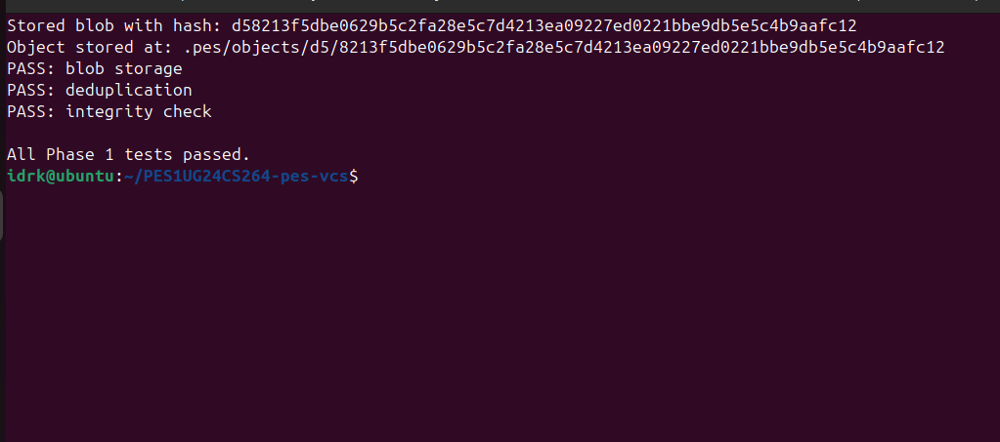
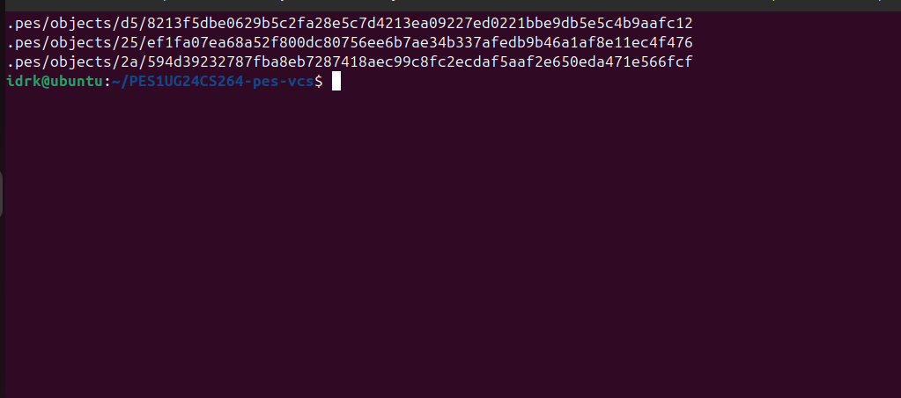
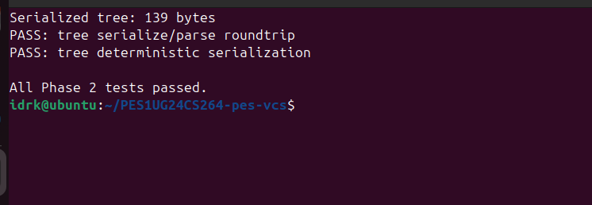
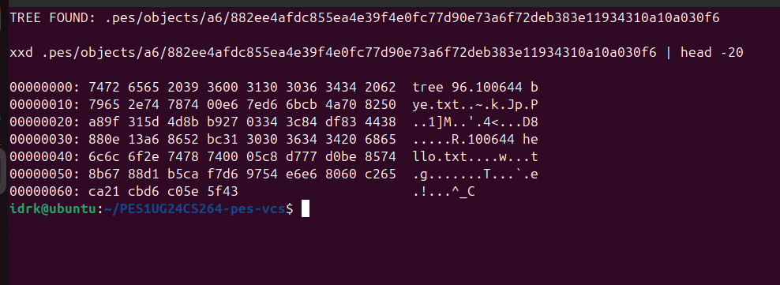
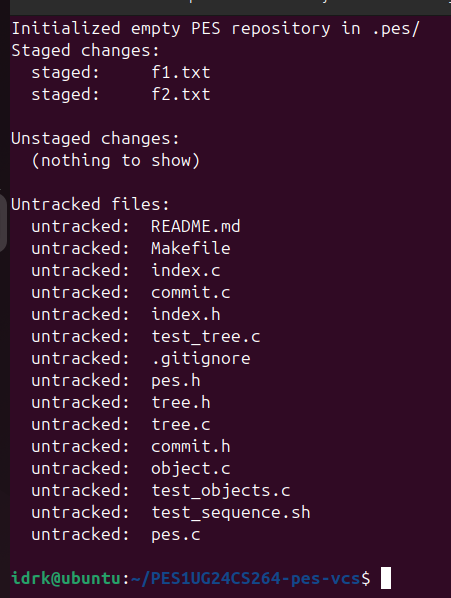
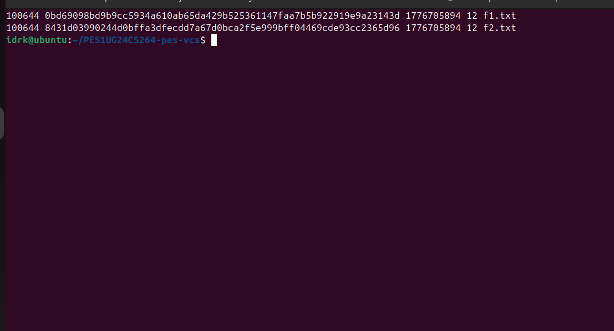
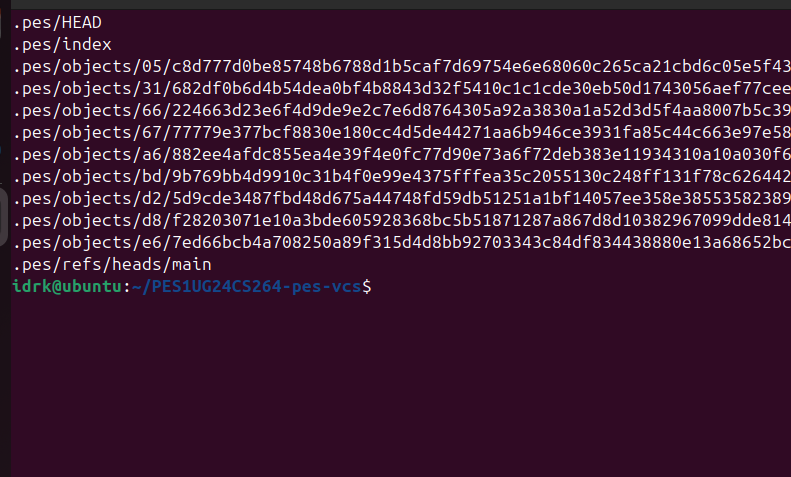
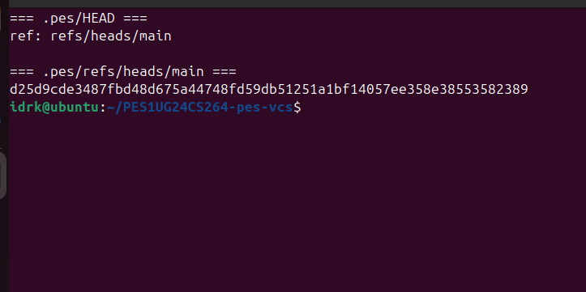
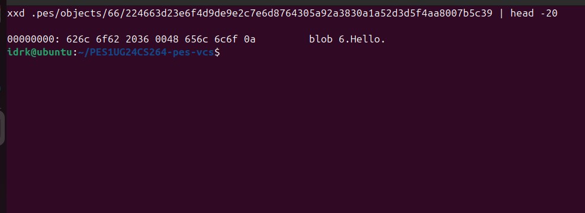
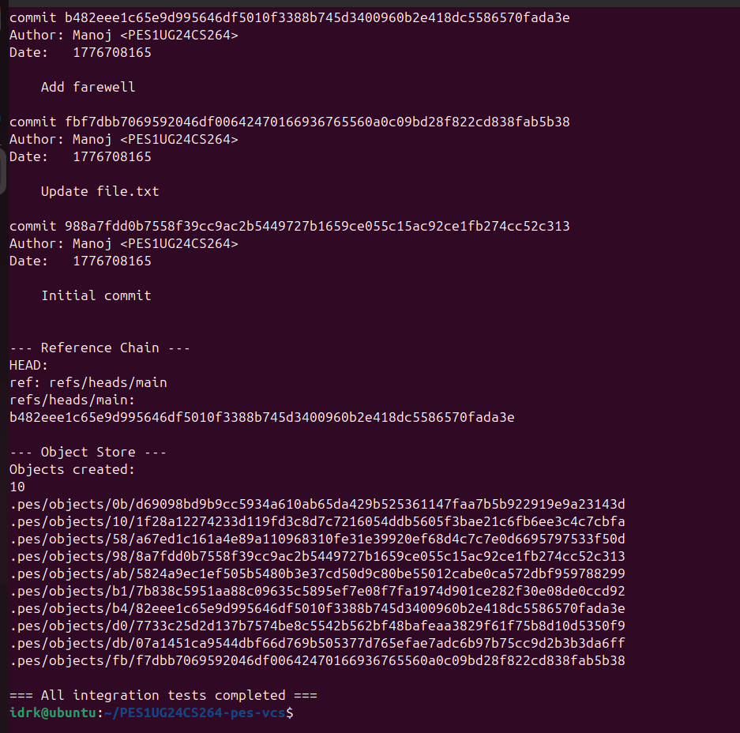

# PES-VCS Lab Report

**Name:** Manoj
**SRN:** PES1UG24CS264
**Repository:** https://github.com/mano-glitch-ai/PES1UG24CS264-pes-vcs

---

## Phase 1: Object Storage Foundation

### Screenshot 1A — `./test_objects` output

### Screenshot 1B — Sharded directory structure

---

## Phase 2: Tree Objects

### Screenshot 2A — `./test_tree` output

### Screenshot 2B — Raw binary format of a tree object

---

## Phase 3: The Index (Staging Area)

### Screenshot 3A — `pes init` -> `pes add` -> `pes status` sequence

### Screenshot 3B — Text-format index contents

---

## Phase 4: Commits and History

### Screenshot 4A — `./pes log` showing three commits

### Screenshot 4B — Object store after three commits

### Screenshot 4C — Reference chain (HEAD and refs/heads/main)

---

## Final Integration Test

All integration tests completed successfully.

---

# Analysis Questions

## Q5.1 — Implementing `pes checkout <branch>`

To implement checkout, three things in `.pes/` must change: the contents of `HEAD`, the working directory, and the index. First, `HEAD` must be updated to point at the target branch — rewrite `.pes/HEAD` to contain `ref: refs/heads/<branch>`. The file at `.pes/refs/heads/<branch>` stays the same; we only change the symbolic reference.

Second, the working directory must be rewritten to match the tree snapshot the target branch points at. This means reading the commit object at the new branch's tip, getting its tree hash, walking that tree recursively, and for each blob entry writing its contents back to disk at the tree-recorded path. Files that exist in the current tree but not in the target tree must be deleted. Files that differ must be overwritten.

Third, the index must be rewritten to reflect the new tree exactly — one entry per blob in the target tree, with mode, hash, mtime, size, and path all drawn from the fresh working-directory files.

What makes checkout complex isn't the mechanical file I/O — it's the three-way reasoning about state. Before any changes, the system has to answer: which files does the user have that aren't in either tree (untracked — keep them), which files are tracked and unmodified (safe to replace), and which are tracked but dirty (refuse checkout to prevent data loss)? Additionally the operation must be atomic in spirit: if we update `HEAD` first and then crash midway through writing files, the repo is in a consistent state per Git's model (HEAD says one thing, working directory says another — which `status` will correctly flag), but from the user's perspective the operation is half-done. Real Git mitigates this by doing the filesystem writes before the HEAD update, so a crash before the final pointer swing leaves the old branch state authoritative.

## Q5.2 — Detecting a dirty working directory using only the index and object store

The index gives us the expected state at the last `pes add`: for every tracked path, we have the blob hash, mode, size, and mtime. The object store lets us materialize any tree or blob by hash. Together, these two are enough to detect dirty state without needing the target branch.

For each entry in the current index:
1. `stat()` the path in the working directory.
2. If size or mtime differs from the index entry, the file may be dirty — proceed to step 3. If size and mtime match, the file is clean (Git uses this metadata shortcut to avoid rehashing unchanged files).
3. Read the working-directory file, compute its SHA-256 as a blob (with the `blob <size>\0` header prefix), and compare to the index entry's stored hash. If they differ, the file is dirty.
4. If the path is missing from disk but present in the index, treat as dirty-deleted.

A checkout to a different branch needs an additional step: for each path where the working file is dirty, look up that path in the target tree. If the target tree has the same hash as the current index (meaning both branches agree on this file's contents), the dirty local change is orthogonal to the branch switch and we can either refuse or apply the switch without overwriting — conservative behavior is to refuse. If the target tree has a different hash, the local dirty change would be overwritten by checkout, and the operation must refuse.

This check is entirely local to `.pes/index` and `.pes/objects/` — no network, no comparison to remotes. The index's mtime/size fields are an explicit optimization so that `status` on a large repo doesn't rehash every file every time.

## Q5.3 — Detached HEAD

Detached HEAD means `.pes/HEAD` contains a raw 40-char commit hash instead of `ref: refs/heads/<branch>`. This happens if the user checks out a specific commit rather than a branch.

If the user makes a commit in this state, `commit_create` does what it always does: builds the new commit with the current HEAD's hash as parent, writes the commit object, and calls `head_update`. But `head_update` in detached mode rewrites `.pes/HEAD` directly with the new commit hash, because there's no branch file to update. The new commit is reachable only through `HEAD`.

The danger: if the user then runs `pes checkout <branch>`, `.pes/HEAD` is rewritten to point at that branch, and the orphaned commit is no longer referenced by anything. It still exists as an object in `.pes/objects/`, but no ref points to it. Garbage collection would eventually delete it. The user's work is, to all appearances, lost.

Recovery is possible if the user knows the commit hash (usually visible from the terminal when the commit was made — "Committed: abc123... Add X"). They can create a branch pointing at it: write the hash into `.pes/refs/heads/<rescue-branch>`, then `pes checkout <rescue-branch>`. Now the orphaned commits are reachable and safe from GC.

Real Git also keeps a reflog — a local, per-ref log of every HEAD movement — which lets users recover even when the commit hash is forgotten, via `git reflog` followed by `git branch <name> HEAD@{N}`. PES-VCS doesn't implement reflog, so recovery here depends entirely on the user having noted the commit hash.

## Q6.1 — Finding and deleting unreachable objects

Unreachable objects are blobs, trees, or commits that no branch's history transitively points at. The algorithm is a mark-and-sweep, analogous to garbage collection in runtime systems.

**Mark phase.** Build a set of reachable hashes. Start with all refs: iterate `.pes/refs/heads/*` and include `.pes/HEAD`'s direct hash if detached. For each ref, push its commit hash into a worklist. For each commit on the worklist: insert its hash into the reachable set; read the commit object; add the tree hash and all parent hashes to the worklist. For each tree: insert its hash; read the tree object; add every entry's hash (blob or sub-tree) to the worklist. Blobs have no outgoing pointers, so they terminate the walk.

**Sweep phase.** Iterate every file in `.pes/objects/XX/YYY...`. For each object on disk, reconstruct its full hash from the filename (prefix + suffix). If the hash is not in the reachable set, delete the file.

**Data structure for the reachable set.** A hash set with O(1) expected insertion and lookup. Since SHA-256 hashes are already uniformly distributed, even a simple open-addressing hash table keyed on the 32-byte hash works well. A red-black tree keyed on the hash would also work (O(log n)) but hash tables are simpler and fast enough.

**Scale estimate for 100,000 commits, 50 branches.** Each branch shares most of its history with the others (common ancestors), so distinct reachable commits is probably close to 100,000 rather than 100,000 x 50. Each commit points to one tree. Trees are heavily shared — if a repo has 1000 distinct directories and only ~50 of them change per commit on average, total distinct trees across history is maybe 200,000 to 500,000. Blobs are also shared — a project with 10,000 files where ~20 change per commit has maybe 2 to 5 million distinct blobs across history. Visit count is roughly the sum: ~2 to 6 million object reads during the mark phase. The sweep phase visits the same number of files on disk. With SSDs and a hash table, the whole operation is typically seconds to low minutes at this scale.

## Q6.2 — Race condition between GC and concurrent commits

The race: GC's mark phase computes the reachable set by snapshotting refs at time T1. The sweep phase then deletes every object not in that set, starting at time T2. If a `commit_create` operation begins between T1 and when GC finishes sweeping, the new commit may `object_write` a new tree (or reference an existing blob) into `.pes/objects/`. That new object isn't in GC's reachable set because it didn't exist at T1. During the sweep phase, GC sees this object on disk, finds it's not in the reachable set, and deletes it.

If GC deletes the object before the commit's `head_update` runs, the final commit will reference an object that no longer exists on disk — the repository is corrupt. If GC deletes it after `head_update`, the ref now points at a commit whose tree can't be read.

Git's real GC avoids this with a grace period. By default, any object that becomes unreachable is kept around for two weeks (`gc.pruneExpire=2.weeks.ago`) before actually being deleted. During this window, new refs or commits that point at such an object "revive" it — the next GC sees it's reachable again and skips it. This means a commit in progress when GC runs is safe as long as the commit completes within the grace period.

A stricter approach some systems use is locking: GC acquires an exclusive lock on the repository (e.g., via `flock()` on `.pes/gc.lock`) for the duration of both phases. Any concurrent `pes commit` blocks until GC releases. This guarantees atomicity at the cost of availability. Git's grace-period approach trades some storage (unreachable objects linger for 2 weeks) for non-blocking commits, which is the right tradeoff for most workflows.
